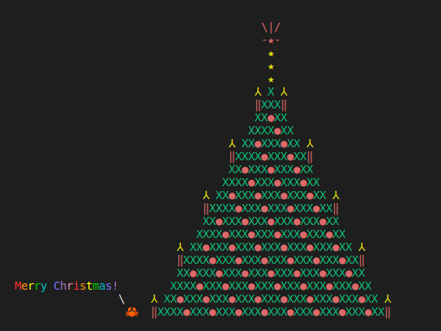

# RustmasTree

Build a rusty christmas tree in ASCII and some unicode. 

## Build and run

```
cargo build
cargo run
```

<details>
<summary>click here to see the output (Spoiler alert)!</summary>



</details>